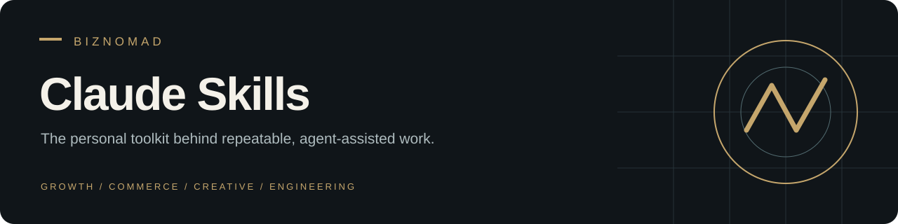

<p align="center"><strong>A personal operating toolkit for Claude Code.</strong></p>
<p align="center"><a href="#start-with-an-outcome">Explore</a> · <a href="#install-one-skill">Install</a> · <a href="#maintaining-local-snapshots">Maintain</a> · <a href="https://github.com/Biznomad/agent-skills">Shared library</a></p>

Personal Claude Code skills organized as standalone folders. Use a skill by its slash command or description, with your own business context and connected tools.

## Start with an outcome

| You want to… | Start here |
| :--- | :--- |
| Plan acquisition and bring past customers back | [Growth Evidence & Reactivation](growth-evidence-and-reactivation/SKILL.md) |
| Audit paid advertising | [Ads Audit](ads-audit/SKILL.md) |
| Improve a Shopify store's conversion journey | [Shopify CRO Audit](Biznomad-shopify-cro-audit/SKILL.md) |
| Work on organic search visibility | [SEO](seo/SKILL.md) |
| Build a polished web interface | [Frontend Design](frontend-design-pro/SKILL.md) |
| Create programmatic video | [Remotion Video Production](remotion-video-production/SKILL.md) |
| Work with Cloudflare infrastructure | [Cloudflare](cloudflare/SKILL.md) |

## Featured: Growth Evidence & Reactivation

Turn disconnected business reports into a usable acquisition and customer win-back plan. The skill adapts to ecommerce, services and subscriptions.

**Reconcile evidence → understand margins → plan acquisition → prepare reactivation.**

It produces a source-backed scorecard, discrepancy log, campaign recommendations, eligible customer segments, message drafts and a prioritized roadmap. It can also prepare one consolidated data request for your existing agents. Analysis and drafts are the default; live changes require authorization.

```text
/growth-evidence-and-reactivation Build an acquisition and customer reactivation package for [business], prioritizing [offer], in [market/language].
```

## Install one skill

Start with the skill you need. The examples below install the featured workflow into Claude Code.

**macOS / Linux / Git Bash**

```bash
git clone https://github.com/Biznomad/claude-skills.git
mkdir -p ~/.claude/skills
cp -R claude-skills/growth-evidence-and-reactivation ~/.claude/skills/
```

**Windows PowerShell**

```powershell
git clone https://github.com/Biznomad/claude-skills.git
New-Item -ItemType Directory -Force "$HOME/.claude/skills" | Out-Null
Copy-Item -Recurse ./claude-skills/growth-evidence-and-reactivation "$HOME/.claude/skills/"
```

Review an existing installation before replacing it. Skills may need their own tools, dependencies or account connections; read the selected skill before running it.

## Inside a skill

```text
skill-name/
├── SKILL.md       # Purpose, triggers and workflow
├── references/    # Detailed guidance, loaded when relevant
├── scripts/       # Optional executable helpers
└── assets/        # Optional output resources
```

Each skill is independently inspectable. Some also include agent-specific interface metadata.

## Maintaining local snapshots

Some folders are committed copies of skills from `~/.agents/skills/`. They are real directories so the repository can be cloned independently of the original machine.

After updating your local shared skills, inspect and run [`sync-from-agents.sh`](sync-from-agents.sh). It replaces matching repository folders from the local store; review local changes first. New skills are not automatically added by the script.

```bash
./sync-from-agents.sh
git status --short
git diff
```

Review the diff, then stage and commit only the intended changes. For a new machine, inspect [`bootstrap.sh`](bootstrap.sh) before running it.

Third-party toolkits such as `gstack` and `email-marketing-bible` maintain separate upstreams and are excluded here, along with generated environments and binary media.

## Adding a skill

Create a folder containing `SKILL.md` with YAML `name` and `description`. Add supporting references or helpers only when needed. Keep client records and credentials outside the skill. If the local shared store is canonical, add the skill there as well.

## Personal toolkit or shared library?

This repository is the personal Claude Code collection. [Agent Skills](https://github.com/Biznomad/agent-skills) is the curated, shareable library for compatible agents. They are separate copies and do not automatically synchronize.

## Credential hygiene

Do not commit API keys, tokens or private client data. Removing a credential from current files does not remove it from Git history or revoke it. An embedded Google API key was removed from the current files; owner-side revocation remains unverified. Neither repository should be treated as a credential store.
